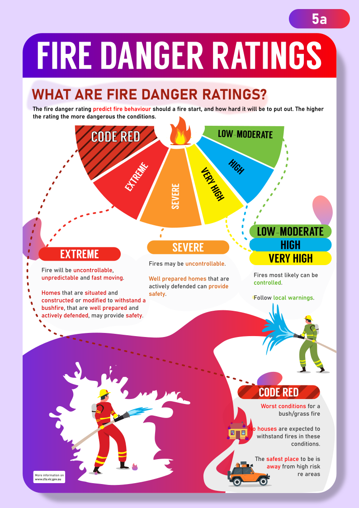
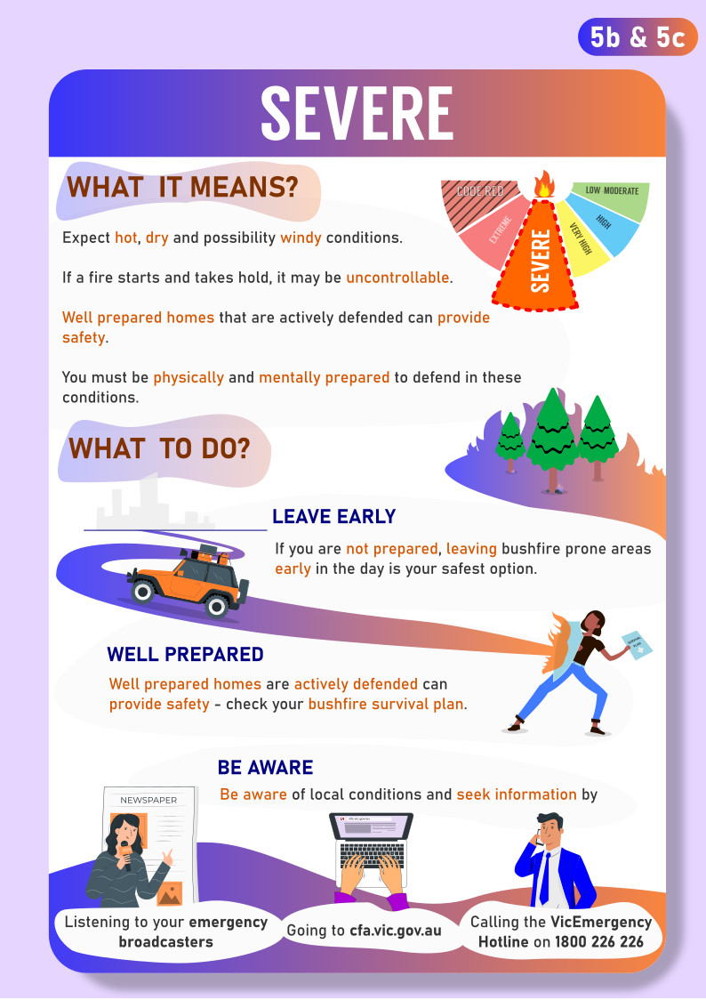
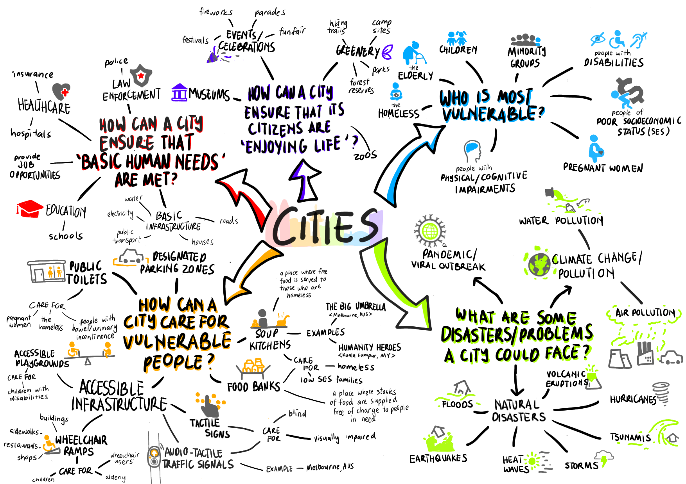

<h1 align="center"><b> Environment, Development and Design (EDD) Notes </b></h1>

> Related: [TCFS NOTES](/tcfs-notes/README.md)

* Most Notes were originally written in OneNote, RemNote or Google Docs before being converted/exported into GitHub-Flavoured Markdown (.md) files 

<h1> Table of Contents </h1>

Table of Contents

- [1 Population Growth and Resources](#1-population-growth-and-resources)
- [2 What is Sustainability](#2-what-is-sustainability)
- [3 Sustainable Business](#3-sustainable-business)
- [4 Economic Sustainability and Globalisation](#4-economic-sustainability-and-globalisation)
- [5 Social Sustainability and Women](#5-social-sustainability-and-women)
- [6 Climate Change and the Enhanced Greenhouse Effect](#6-climate-change-and-the-enhanced-greenhouse-effect)
- [7 Consequences of climate change and hazards](#7-consequences-of-climate-change-and-hazards)
- [8 Research Report](#8-research-report)
- [9 Who and what is most affected by climate change](#9-who-and-what-is-most-affected-by-climate-change)
- [10 Responses to Climate Change](#10-responses-to-climate-change)
- [11 Renewable Energy](#11-renewable-energy)
- [12 What is a city?](#12-what-is-a-city)
- [13 Resilient and Liveable Cities](#13-resilient-and-liveable-cities)
- [14 Sustainable City Design](#14-sustainable-city-design)
- [15 Melbourne: A sustainable, liveable and resilient city?](#15-melbourne-a-sustainable-liveable-and-resilient-city)
- [16 Mega Cities](#16-mega-cities)
- [17 Sustainable Building Design](#17-sustainable-building-design)
- [18 Water](#18-water)
- [19 Slums](#19-slums)
- [20 Urban agriculture](#20-urban-agriculture)
- [21 Global Migration and Refugees](#21-global-migration-and-refugees)

# 1 Population Growth and Resources
* [Summary Notes](sem1/edd-1-summary-notes.md)
# 2 What is Sustainability
* [Summary Notes](sem1/edd-2-summary-notes.md)
# 3 Sustainable Business
* [Summary Notes](sem1/edd-3-summary-notes.md)
# 4 Economic Sustainability and Globalisation
* [Summary Notes](sem1/edd-4-summary-notes.md)
# 5 Social Sustainability and Women
* [Summary Notes](sem1/edd-5-summary-notes.md)
# 6 Climate Change and the Enhanced Greenhouse Effect
* [Summary Notes](sem1/edd-6-summary-notes.md)
# 7 Consequences of climate change and hazards
* [Summary Notes](sem1/edd-7-summary-notes.md)
# 8 Research Report
* Question 5 posters (background wasn't meant to be purple, it was supposed to be grey...)
  * 
  * 
  * 
# 9 Who and what is most affected by climate change
# 10 Responses to Climate Change
* [Summary Notes](sem1/edd-10-summary-notes.md)
# 11 Renewable Energy
* [Summary Notes](sem2/edd-11-summary-notes.md)
# 12 What is a city?
* 
# 13 Resilient and Liveable Cities
* [Summary Notes](sem2/edd-13-summary-notes.md)
# 14 Sustainable City Design
* [Urban Green Notes](sem2/the-urban-green-notes.md)
# 15 Melbourne: A sustainable, liveable and resilient city?
* Didn't take any notes on this topic:<
# 16 Mega Cities
* [Summary Notes](sem2/edd-16-summary-notes.md)
# 17 Sustainable Building Design
* Didn't take any notes on this topic:<
# 18 Water
* Didn't take any notes on this topic:<
# 19 Slums
* Didn't take any notes on this topic:<
# 20 Urban agriculture
* Didn't take any notes on this topic:<
# 21 Global Migration and Refugees
* Didn't take any notes on this topic:<
