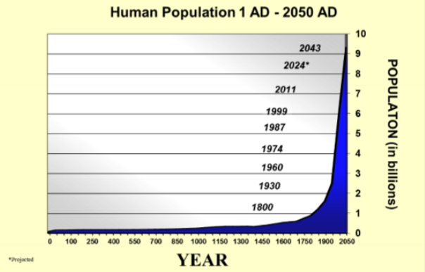
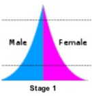
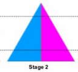
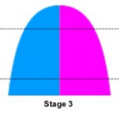
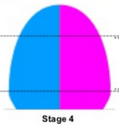
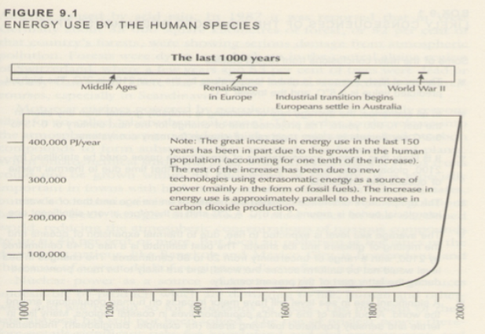
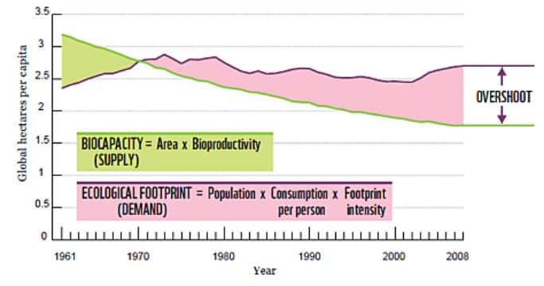

<h1 align="center"><b> 1 Population Growth and Resources Summary Notes </b></h1>

> Related: [EDD Notes](/tcfs-notes/EDD/README.md)

<h1> Table of Contents </h1>

  
Table of Contents

- [Population](#population)
- [Resources](#resources)

# Population
- Population definition: A group of individuals of the same species that inhabit a particular area 
- Population Growth Graph
    - 
    - J-curve
    - exponential growth: rate of increase becomes more and more rapid the longer the exponential growth continues
- Population Growth Rate definition: rate at which the population changes in size; calculated by subtracting the number of people who leave a population from the number of people who enter a population 
    - how people enter a population
        - immigration
        - birth
    - how people leave a population
        - emigration
        - death
- Population Pyramid definition: graph that shows the percentage/number of males and females in each age group; used to interpret the population structure of a country 
- Demographic Transition Model (DTM): used to represent the movement of high birth and death rates to low birth and death rates as a country develops from pre-industrial to an industrialized economic system
    - Stage 1: High Stationary 
        - graph: 
        - examples: a few remote groups
        - birth rate: high
        - death rate: high
        - natural increase: stable or slow increase
        - reasons for changes in birth rate
            - many children needed for farming
            - many children die at early age
            - religious or social encouragement
            - no family planning
            - lack of education for girls and women
            - child marriage
            - no contraceptives
        - reasons for changes in death rate
            - disease
            - famine
            - poor medical knowledge
            - lack of clean water and sanitation
        - reasons for changes in death rate
        - natural increase 
        - birth rate birth rate
    - Stage 2: Early Expanding 
        - graph: 
        - examples
            - Egypt
            - Kenya
            - India
        - birth rate: high
        - death rate: high, but fewer than Stage 1
        - natural increase: very rapid increase
        - reasons for changes in birth rate  (same as Stage 1: High Stationary)
            - many children needed for farming
            - many children die at early age
            - religious or social encouragement
            - no family planning
            - lack of education for girls and women
            - child marriage
            - no contraceptives
        - reasons for changes in death rate
            - fewer children die
            - improvements in medical care
            - improvements in water supply
            - improvements in sanitation
        - reasons for changes in death rate 
        - natural increase 
        - birth rate 
    - Stage 3: Late Expanding 
        - graph: 
        - examples: Brazil
        - birth rate: Increase slows down
        - death rate: increase slows down
        - natural increase: increase slows down
        - reasons for changes in birth rate
            - improved medical care and diet
            - fewer children needed for farming
        - reasons for changes in death rate  (same as Stage 2: Early Expanding)
            - fewer children die
            - improvements in medical care
            - improvements in water supply
            - improvements in sanitation
        - reasons for changes in death rate 
        - natural increase 
        - birth rate 
    - Stage 4: Low Stationary 
        - graph: 
        - [examples
            - US
            - UK
            - Japan
            - France
        - birth rate: low
        - death rate: low
        - natural increase: stable or slow increase
        - reasons for changes in birth rate
            - family planning
            - good healthcare
            - improving status of women
            - later marriages
        - reasons for changes in death rate
            - good healthcare
            - reliable food supply
        - reasons for changes in death rate 
        - natural increase 
        - birth rate 
    - Stage 5: Declining 
        - graph: 
        - examples: Germany
        - birth rate: very low 
        - death rate: very low
        - natural increase: slow decrease 
        - reasons for changes in birth rate
        -   (same as Stage 4: Low Stationary)
            - family planning
            - good healthcare
            - improving status of owmen
            - later marriages
        - reasons for changes in death rate (same as Stage 4: Low Stationary)
            - good healthcare
            - reliable food supply
        - reasons for changes in death rate 
        - natural increase 
        - birth rate 
# Resources
- Resource definition: anything that can be used by humans to satisfy a particular need or requirement 
- 25% of the world's resources are consumed by the poorest 75% of the world's population
- Energy Use against Year Graph
    - 
    - J-curve with exponential growth
    - similar to Population Growth Graph
- Classification of Resources
    - Natural and Renewable
        - Natural and Renewable resourcedefinition: a resource which, over a human timescale is inexhaustible; they are unaffected by human activities 
        - examples: 
            - solar
            - tidal
            - wind
            - wave
            - hydroelectric
            - geothermal
    - Natural and Potentially Renewable
        - Natural and Potentially Renewable resourcedefinition: a resource which can be rapidly replenished (hours to decades) through natural processes 
        - examples: 
            - clean water
            - animals
            - fertile soil
    - Natural & Non-Renewable
        - Natural and Non-Renewable resourcedefinition: a resources that are in a finite supply or take a very long time to be replenished (millions to billions of years) 
        - examples: 
            - coal
            - natural gas
            - oil
            - minerals (Uranium)
            - metals (iron, nickel)
    - Human
        - examples: 
            - skills
            - intelligence
            - knowledge
            - attitude
            - work or labour
            - infrastructure (roads and building)
- factors that change resource use
    - age
    - environment
    - income
    - culture
    - gender
    - place of residence
    - state of economy
    - stage of development and technology levels
- ways to measure environmental impact
    - On an environmental scale from 0 to 10
        - 0 is untouched by humans
            - examples:  Antarctica, Forest Reserves
        - 10 is dominated by humans
            - examples: Cities, Megacities
    - Ecological Footprint definition: how fast we consume resources and generate waste compared to how fast nature can absorb our waste and generate new resources; the amount of biologically productive land needed to support one person, city or nation 
- Biocapacity definition: the amount of biologically productive land and water available to provide or supply our resources and to deal with the waste we produce 
- Ecological Footprint VS Biocapacity
    - demand VS availability
- Carrying capacity definition: the number of organisms of the same species an environment can support 
- Overshoot definition: the situation where a population exceeds the biocapacity and the carrying capacity of the environment 
    - case study: Eastern Islanders
        - they cut down all the trees on their island to help with the building of giant statues
        - this caused soil erosion and species extinction, leading to a lack of food
        - the Eastern Islanders resorted to cannibalism
    - 
- Ecological Deficit definition: the situation where a region's Ecological Footprint exceeds its Biocapacity 
- Ecological Reserve definition: the situation where a region's Biocapcity exceeds its Ecological Footprint 
