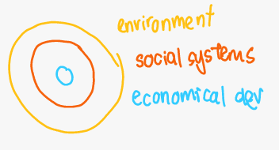
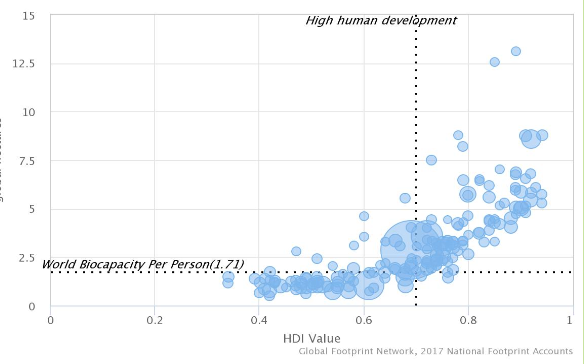
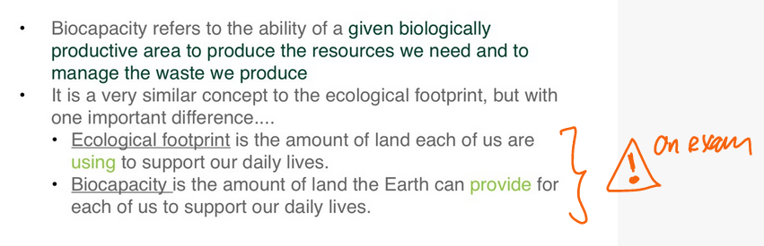

<h1 align="center"><b> 2 What is Sustainability Summary Notes </b></h1>

> Related: [EDD Notes](/tcfs-notes/EDD/README.md)

- Sustainability : something is classed sustainable when the economy, society and environment is able to grow and thrive
- Sustainable Development : meeting the needs of the present without damaging the ability of future generations to meet their own needs
    - diagram: 
- Ecologically Sustainable Development : using, conserving and enhancing the community's resources so that ecological processes, on which life depends, are maintained, and the total quality of life, now and in the future, can be increased (Australia's National Strategy for Ecologically Sustainable Development, 1992)
    - diagram: 
    - recognized at the 2002 World Summit for Sustainable Development
    - 
- Ecologically Sustainable Development Timeline
    - Ancient civilizations
        - lived with nature
        - respected and understood the need for sustainable use of resources
            - the properties of plants and animals
            - functioning of the ecosystems
            - techniques to managing the ecosystems
            - use of resources (for sustaining livelihood)
    - Green Revolution
        - Intensive use of land and soil for mass production of food with the use of machines and pesticides and herbicides to kill pests
        - Intensive, large-scale animal production and fish catching
        - An increase in agricultural production, especially in the developing world
    - Industrialization, Economic growth and development
        - mass production
        - city expansion
        - isolation from the land
        - loss of connection to nature
        - economic growth became the main aim of governments and individuals
    - 1960s | Awareness
        - awareness of the fragility of nature and the biosphere
    - 1970s | Environmental Awareness
        - forest loss
        - air, land and river pollution
        - oil crisis
        - infertile land
        - extinctions and loss of flora and fauna
        - working and living in polluted environments
        - birth of environmental movement
    - 1987 | Montreal Protocol
        - was designed to stop the production and import of ozone depleting substances and reduce their concentration in the atmosphere to help protect the earth's ozone layer
        - is widely considered as the most successful environment protection agreement
        - sets binding obligations for developed and developing countries for all the major damaging transitional chemicals such as hydrochlorofluorocarbons (CFCs)
        - ozone depleting substances, including chlorofluorocarbons (CFCs), halons and less
    - 1992 Rio Declaration (UNCED) UN Conference on Environment and Development
        - 3 major agreements
            - agenda 21
                - an unprecedented global plan of action for sustainable development
            - the Rio Declaration on Environment and Development
                - a series of principles defining the rights and responsibilities of States
            - the Statement of Forest Principles
                - a set of principles to underpin the sustainable management of forests worldwide
    - 1997 Kyoto Protocol
        - International agreement with targets to reduce GHG emissions
    - 2000 | 8 Millennium Development Goals
    - 2015 | 17 Sustainable Development Goals (SDGs)
        - Sustainable Development Goals (SDG): Providing  economic transformation and opportunity to lift people out of poverty,  advancing social justice and protecting the environment
- Human Development Index (HDI) : combines a country's achievements in health, education and income with how those achievements are distributed among country's population
- Graph of Ecological Footprint VS HDI
    - 
    - Positive correlation
    - The higher the HDI, the higher the Ecological Footprint
- ESD in different countries
    - Developed countries
        - economic growth without damaging the biosphere
        - fair trade and responsible business
        - uphold and honor equal rights
        - alternative sources to meet energy demands - implementing renewable energy
        - recycling more
        - producing less waste
        - sustainable city design
        - sharing technology with less developed nations
    - Developing countries
        - improve living conditions
        - build infrastructure
            - water supply
            - energy
            - waste disposal
            - transport
        - health services
        - education
        - family planning
        - reducing poverty
        - improving agricultural techniques
        - managing traffic congestion
    - ESD at different scales
        - International
            - ESD International : co-operation between governments and international non-government organizations (NGOs)
            - 
                - international agreements (Kyoto Protocol, Paris Climate Agreement)  
                - international aid programs
                - technology and research (FAO)  
        - National
            - ESD national : government policy and laws
            - 
                - increase renewable energy targets
                - recycling
                - increase public transport funding
                - pollution and waste
                - education
                - economic growth
                - forest protection
                - trade
        - Local/Individual
            - ESD local
                - public awareness raising
                - education
                - social responsibility
                - concern for the planet and its future
                - consumer habits
            - level 1 
                - turn off lights
                - stop paper bank statements and pay bills online or via mobile
            - level 2 
                - take short showers that last no longer than 10 minutes
                - buy minimally packaged goods
            - level 3 
                - shop local
                - shop smart
            - level 4 
                - give away unwanted food
                - reduce waste
                - bike, walk or take public transport instead of driving
-   
- what is the difference between biocapacity and ecological footprint?
    - ecological footprint is the amount of land each of us are using to support our daily lives
    - biocapacity is the amount of land the Earth can provide for each of us to support our daily lives
    - ecological footprint is demand and biocapacity is supply
- Biophysical Environment: the biotic and abiotic surrounding of an organism or population
- Ecosystem : a biological community of interacting organisms and their physical environment
- NGO : a non-profit organization that operated independently of any government,  typically one whose purpose is to address a social or political issue