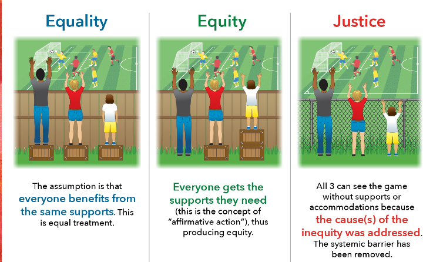
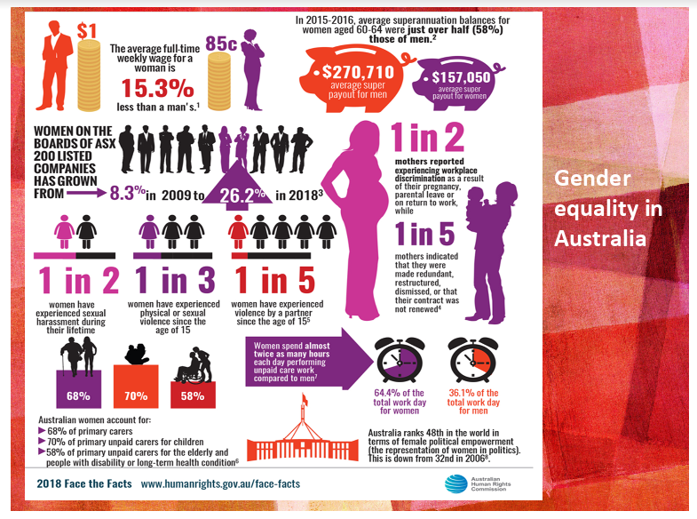

<h1 align="center"><b> 5 Social Sustainability and Women Summary Notes </b></h1>

> Related: [EDD Notes](/tcfs-notes/EDD/README.md)

- Social sustainability [~definition](link_generated_on_download):: a positive condition that is marked by a strong sense of social cohesion within the community and equity and access to key services (health, transport, recreation, and education) #~definition
    - why social sustainability is important for development
        - social sustainability indicates social cohesion and equity to key services for all citizens
        - this allows for development to occur in a community and or country
        - the full potential and opportunities for citizens can be reached
- difference between sex and gender
    - Sex: biological and ineradicable differences between women and men
    - Gender: a social and cultural distinction between males and females (that is conditioned into society and confined people to certain roles in that society)
- Gender stereotype [~definition](link_generated_on_download):: a pre-judgement or bias which determines different expectations of what men and women can do #~definition
    - [~examples](link_generated_on_download) #~examples
        - gender roles : stereotype that men are breadwinners of the family while women are housewives
        - gender capacities
        - gender characteristics
    - channels for gender socialization
        - home - toys/tasks/words used
        - media - cartoons/fashion magazines
        - schools/religious institutions - boys vs girls, use of language
- Discrimination [~definition](link_generated_on_download):: directly or indirectly treating girls and women differently from men and boys in a way that prevents them from enjoying their rights #~definition
    - direct discrimination against women and girls [~examples](link_generated_on_download) #~examples
        - women and girls not being allowed to own property
        - not being allowed to drive
        - being excluded from school
        - paid less than a man for equal work
    - indirect discrimination against women and girls [~examples](link_generated_on_download):: size or height restrictions on joining police force, fire brigade or military #~examples
- Gender equality[~definition](link_generated_on_download):: equal rights, responsibilities and equal opportunities for women and men and girls and boys #~definition
    - which Sustainable Development Goal related directly to gender equality?:: SDG 5 - achieve gender equality and empower all women and girls
- Gender inequality [~definition](link_generated_on_download):: unequal treatment of individuals within society, based upon their gender #~definition
- [~stat](link_generated_on_download) on average, women do {{3}} times as much unpaid care and domestic work as men
- Women in leadership
    - [~stat](link_generated_on_download) In 2000, women made up{{ 13.2%}} of national parliaments (single or lower house) globally
    - [~stat](link_generated_on_download) In 2017, women made up {{23.4%}} of national parliaments (single or lower house) globally
    - [~stat](link_generated_on_download) {{ 39%}} of countries worldwide have used some form of quota system to increase women's representation in politics
    - [~stat](link_generated_on_download) less than {{one third}} of senior- and middle- management positions are held by women
    - [~stat](link_generated_on_download) {{47%}} of world business leaders say they arein favor of gender quotas on corporate boards
    - Breaking the Glass Ceiling[~definition](link_generated_on_download):: Only one third of middle and senior management positions are held by women as many #~definition
    - women in the workforce still face discrimination in the workforce and gender stereotypes
    - restrict opportunities for women to be promoted to senior management positions. The term
    - refers to the fact that once women reach a certain level of management there appears as
    - though there is an imaginary glass ceiling preventing them from being promoted to senior
    - ranks in business and government.
- Intimate partner violence
    - Intimate partner violence [~definition](link_generated_on_download):: any behaviour by a current or former partner or spouse that causes physical, sexual and psychological harm. This is one of the most common forms of violence experienced by women globally. #~definition
    - [~stat](link_generated_on_download) 1 in {{5 }}women and girls aged 15-49 reported experiencing physical and/or sexual violence by an intimate partner within a 12-month period
    - [~stat](link_generated_on_download) {{47%}} of women and {{6%}} of men were killed by an intimate partner or family member worldwide internationally
    - [~stat](link_generated_on_download) {{49}} countries have no laws specifically protecting women from domestic violence
    - [~stat](link_generated_on_download) {{27}} countries exempt rape perpetrators from prosecution if they are married to ot subsequently marry a victim
- Sexual Violence
    - sexual violence [~definition](link_generated_on_download):: any sexual act committed against the will of another person, either when this person does not give consent or when consent cannot be given because the person is a child, has a mental disability, or is severely intoxicated or unconscious as a result of alcohol or drugs #~definition
    - [~examples](link_generated_on_download) #~examples
        - sexual harassment
        - rape
- Child Marriage
    - implications
        - end of girl's education, vocation and right to life choices
        - greater risk for intimate partner violence
    - [~stat](link_generated_on_download) over {{750 million}} women and girls alive today were married before their 18th birthday  
- Female Genital mutilation
    - FGM[~definition](link_generated_on_download):: includes procedures that internally alter or cause injury to the female genital organs for non-medical reasons #~definition
    - [~stat](link_generated_on_download) at least {{200 million}} women and girls have undergone female genital mutilation (FGM)
- Infant mortality
- Maternal mortality
- Infanticide [~definition](link_generated_on_download):: the practice of killing newborn infants #~definition
- Family planning
- Empowerment[~definition](link_generated_on_download):: the granting of political, social or economic power to an individual or group #~definition
    - options
        - Country specific: involving local/state/non-state actors.
        - Infrastructure provision: learning kits & material; school buildings; toilets in schools, provision of school meals, bicycles for girls.
        - Education reform: In-service teacher training; child-friendly pedagogies; textbook reforms; radio-programs.
        - Interventions: ‘Remedial’ teaching programs; ‘bridging’ programs to get out of school girls into mainstream education; disability programs, evening classes for women etc.
        - Partnerships: School-Community committees (local involvement).
- Equality, Equity and Justice
    - 
- Gender inequality in Australia
    - 