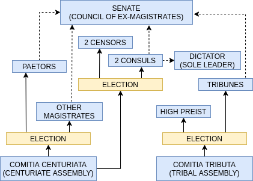

<h1 align="center"><b> 4 Introduction to the Roman Republic Summary Notes </b></h1>

> Related: [HOI Notes](/tcfs-notes/HOI/README.md) | [3 Hellenisation and Stoicism Summary Notes](hoi-3-summary-notes.md) | [5 Fall of the Roman Republic Summary Notes](hoi-5-summary-notes.md)

<h1> Table of Contents </h1>

Table of Contents

- [Introduction](#introduction)
- [Roman Republic, 509-27 BC](#roman-republic-509-27-bc)
  - [Liberty and Law](#liberty-and-law)
  - [Government](#government)
  - [Tradition and Values](#tradition-and-values)
- [Rome, 146-49 BC](#rome-146-49-bc)
  - [Greek Ideas](#greek-ideas)
  - [Challenge to Traditional Values](#challenge-to-traditional-values)
  - [Optimates and Populares](#optimates-and-populares)
- [Julius Caesar: 'People's Dictator'](#julius-caesar-peoples-dictator)
  - [Julius Caesar (100-44BC)](#julius-caesar-100-44bc)
  - [Augustus](#augustus)
- [Augustus Tutorial Questiosn](#augustus-tutorial-questiosn)

# Introduction
* Greeks vs Romans
  |Greeks|Romans|
  |:--|:--|
  |Gave western civilisation philosophy and politics|Gave it law and government|
  |Theoretical|Practical|
# Roman Republic, 509-27 BC
## Liberty and Law
## Government
* The Senate was the centre of government and it was composed of all magistrates (holders of political office) and ex-magistrates 
* About 300 men 
* The Senate had complete control over state finanaces and foreign policy 
* To enter the Sneate a man needs two things 
  1. Money 
     * Independent fortune necause there was a property qualification of one million silver coins 
   1. Election 
      *  Magistrates were elcted by the Roman people each year 
* Consuls(powerful and respected officials) directed the debates in the Senate 
* The Roman Republic was a paradox 
* Roman citizens were sovereign - voting for their politicians 
* But, because of the property qualification, they could not stand for election themselves 
* Government of Roman Republic was an elected aristocracy 
* Ten Tribunes of the People (Plebs)
  * elected every year 
  * serve the interests of the Roman citizens 
  * assisted citizens who were distressed by unjust decisions 
  * Could call a public meeting and block (veto) laws against the interests of the people 
  * No one could touch the tribunes
  * Could overide the magistrates 
* *Comitia Centuriata*
* *Comitia Tributa* 
  * They spread the power around - so no one had too much power> 
## Tradition and Values
* Ancient Rome was a very traditional and conservative society 
* The 'custom of the ancestors' 
* Romans fif not like new ideas, or new things 
* Two traditional values 
  1. *Dignitas*, which means 'merit' (English 'dignity') 
     * The roman citizen voted for aristocrats on the basis of merit: whether the aristocrat had enough merit to enter the Sentae, and whether he had higher levels of merit to rise in rank in the Senate 
   2. *Auctoritas*, which means 'influence' (English 'authority') 
      * If an aristocrat was jusged to have dignitas (/merit/), he now had autoricas ('influence') 
      * The higher the rank the aristocrat was elected to,  the more auctoritas ('influence') he had
# Rome, 146-49 BC
## Greek Ideas
* Rome expanded to become a world military power between 509 and 146 BC 
* Rome was in control of Greece 
* Greek ideas entered Rome, especially through Stoic philosophy 
* The Stoic idea of love of man (philanthropy) entered Rome and became 'humanity' (humanitas), the regard for each other as a principle of action 
* What happens when new ideasenter into a traditional, conservative society?
## Challenge to Traditional Values
* In 133BC, Tiberius Gracchus (163-133BC) became tribune 
  * Was a reformer 
  * Advised by a Stoic philosopher called Blossius 
* In 133BC. Tiberius proposed an agarian law directly to the people 
  * Law resumed public land, has been occupied by wealthy aristocratic families 
* Triberius denounced the situation asunfair, and he claimed to act out of the principles of fairness 
* Tiberius' agrarian law was passed 
* But Triberius and his supporters were killed by his opponents 
* Tiberius' reform programme, however, was continued by his younger brother Gaius Gracchus, who was elected tribune 
  * He also claimed to act in fairness 
* In 121BC, Gaius and 3,000 of his supporters were killed by their opponents 
* These brothers were known as the Gracchi
## Optimates and Populares
* The policies of the Gracchi divided Rome, and political parties emerged after 133BC

|Optimates|Populares|
|:--|:--|
|In favour of aristocracy|Favour the people|
|Stood for tradition; against reform|Stood for reform|
|- Equality and fairness: it is fair that a person's amount of wealth equals his amount of merit -Benefits must equal merit|- People have the right to a fair share - Equality and fairness: it is fair to distribute public wealth more equally - Citizens should receive an equal share from the benefits of the Roman empire|

# Julius Caesar: 'People's Dictator'
## Julius Caesar (100-44BC)
* He marched his army into Romw in 49BC 
* Caesar claimed his dignitas ('merit') was greater than other Romans, and it did not need to be judged by the Roman citizens 
* He had himself declared 'Dictator' 
* Caesar had placed himself aboce the law and constitution 
* His pollitical idealogy was the ideology of a king 
* He claimed to exercise 'mercy' and the most merciful man is the most powerful man, the king 
* 44BC, Caesar was murdered 
* But liberty and the rule of law were not restored, and Rome became ruled by an emporer (Augustus, Caesar's adopted son) 
* Power was now seized by one man 
## Augustus
* 'The exalted one' 
* 'The Princep' 
* Caesar's adopted son 
* First roman emperor

# Augustus Tutorial Questiosn
1. What are the two main principles of the Roman Republic?
   * Liberty and Law
2. Why did the Romans get rid of their kings? When did they go it? What did this mark the beginning of? 
   * Kings were arbitrary and unfair 
   * 509 BC, the king was expelled from Rome and replaced by the Republic 
   * It marked the beginning of Res punlica Romana (the Roman Republic) 
   * Rome was initially a small and insignificant city controlled by Etruscan Kings. In 509 BC, they overthrew the tyrannical King Tarquinius Superbus (Latin for proud, arrogant) and started the Roman Republic.  
3. What was the significance of the Twelve Tables?
   * The twelve Tables were the first Roman code of Law, introduced around 450BC 
   * Prior to this law, was customary (not a written down code) and was often applied in an arbitrary way that went against the interests of the common people 
   * The Twelve Tables set out legal procedures and punishments that were to be applied to all citizens 
   * Note that the laws themselves took into account the status of victims and perpetrators, so people were not equal before the law in quite the same way they are in modern law 
4. Summary of some of the laws of the 12 Tables 
   * 4.3 A baby born very deformed must be killed 
   * 6.5 A woman who lives with a man for a year is subject to his power like a wife 
   * 8.2 If anyone breaks a bone of a free man, he must pay 300 coins; if he breaks a bone of a slave, he must pay 150 coins 
   * 9.6 it is forbidden to kill anyone who is not guilty of a crime. 
   * 9.1. No privileges or laws will be made for one person, against the law for all citizens. 
   * 9.3. A judge guilty of accepting bribes will be executed. 
   * 11.2 Patricians must not marry plebeians. 
   * 12 .5 Whatever the people last ordered will be the valid law 
5. What are the features of the Roman Republic?
   * Magistrates
6. Define Senate
   * Most important political institution. Centre of Roman government. 300 men (although only a 100 men at any one meeting). Magistrates and Ex-Magistrates. Ex-consuls have the highest rank. Complete control of finances and foreign policy. Discussed law and then made recommendations to the people. The people would then vote on whether to support the law or not. The people could vote but not govern. 
7. How did someone become a senator?
   * By the late Republic there was a poverty qualification: Senators had to own property worth 1,000,000 sesterces (a loaf of bread cost approx half a sesterce; a Roman soldier might be paid 900 sesterce per year) 
8. Define Consuls 
   * Highest elected officials. There were always 2 Consuls. 
   * They directed the discussion in the senate, they decided what would be discussed and how 
   * Could only serve for one year 
   * Had to be 42 
   * Both Consuls had to agree on decisions. This was to limit the power of individuals  
9.  Define Tribunes (of the plebeians) 
    * 10 tribunes elected by the tribal assembly 
    * One-year term 
    * Tribunes could veto any election, law or acts by other magistrates. Could propose new laws. 
    * They were meant to look after the interests of the plebeians, but it didn’t always work this way.   
10.  Define *Domitian Centuriata* 
     * One of the two assemblies responsible for the election of magistrates 
     * Responsible for electing senior magistrates 
     * Could pass laws proposed by a magistrate 
11.  Define *Comitia Tributa*
     * One of the two assemblies responsible for the election of magistrates 
     * Responsible for electing Tribunes 
     * Could pass laws proposed by a Tribunes 
     * Responsible for electing the High Pries
12. Who actually governed Rome? 
    * The people were sovereign but because of the property qualification Rome was actually governed by an elected aristocracy 
    * It was NOT a democracy
13. What was *dignitas*? 
     * Merit or status 
     * The way in which a person displays the virtues of Roman tradition (mos maiorum- an unwritten code of social behaviour) and was the central concept in elections.  
     * If a person had high dignitas then they had high auctoritas (influence). This translated to high rank

