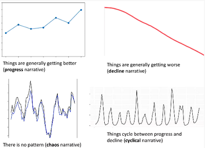

<h1 align="center"><b> 16 Enlightenment Reason and Progress Summary Notes </b></h1>

> Related: [HOI Notes](/tcfs-notes/HOI/README.md) | [14 Enlightenment Ideas and Society Summary Notes](hoi-14-summary-notes.md) | [17 Enlightenment Revolution](hoi-17-summary-notes.md)

<h1>Table of Contents</h1>

- [Is the World Getting Better?](#is-the-world-getting-better)
  - [Stephen Pinker](#stephen-pinker)
- [Argument (Essay Practice-ish)](#argument-essay-practice-ish)
- [Key Characteristics of Enlightenment Thought](#key-characteristics-of-enlightenment-thought)
- [Empiricism, Rationalism and Skepticism](#empiricism-rationalism-and-skepticism)
- [Idea of 'Progress' and Enlightenment Thought](#idea-of-progress-and-enlightenment-thought)

# Is the World Getting Better?
* Ways historians think of the world:
  
## Stephen Pinker
* argues that the world is getting better 
* because of Enlightenment ideas and values 
# Argument (Essay Practice-ish)
* 'Evaluate' 
  * means evaluating a source or weighing up an argument 
* 'Argument' 
  * connected series of supporting statements (premises) to establish a claim (your conclusion or thesis statement) 
* Thesis statement example 
  * I will argue that the skeptical arguments of the Enlightenment philosopher David Hume can be used to question Pinker's claim. Pinket's argumenr ultimately rests on the idea that we can predicate claims about what will happen in the future based on what has happened in the past, but Hume demonstrates that this kind of inductive argument cannot provide knowledge as it assumes the uniformity of nature — an assumption that wc cannot use reason to support. 
* Brief 'map' example 
  * After setting out Pinker's claim against the background of Enlightenment thought about reason and progress, I will explain Hume's skeptical argument against using inductive reason to find truth. This Will then be used to analyse Pinker's claims. 
1. Set out Pinker's claim 
2. Provide background of Enlightenment thought about reason and progress 
    * AKA "long 18th century" or "Age of Reason" 
    * between Scientific 'Revolution' and French Revolution 
    * Different strands of related thought, debate and attitudes 
    * People became self-conscious about living in the Enlightenment 
    * Philosphes and secular culture 
    * Immanuel Kant 
      * Enlightenment is "Bringing the light into the darkness of the mind" 
    * Ideas include: 
      * reason 
      * religious tolerance 
      * freedom 
      * 'new science' 
        * Newton, Gallelaio, Bacon - overturned Aristotelian views 
        * searching for universal, fundamental laws 
        * based on observation, experiment and reason 
      * critical thought 
        * criticism of old methods and institutions, including the intellectual authority of religion 
        * "The antiquity and general acceptance of an opinion is not an assurance of its truth" (Pierre Bayle) 
    * Rationalism V Empiricism 
      |Rationalism|Empiricism|
      |:--|:--|
      |our knowledge and our concepts are in important ways independent of our sense experiences|All our concepts and knowledge of the world are ultimately derived from our sense experiences - seeing , touching, hearing, etc. |
    * Skepticism 
      * Can I trust that this is the truth? 
    * Rene Decart 
      * To reach certain knowledge we must doubt everything we can 
      * uses skepticism to reach the truth that is for certain 
      * our senses can deceive us, as in an illusion or a dream 
      * I think, therefore I am 
        * "I" am a thinking thing, distinct from matter 
        * This is for certain but nothing else is for certain 
    * John Locke 
      * Political philosophy 
      * Our minds are a blank slate (tabula rasa) 
      * Knowledge comes from taking in information through our senses and reflecting on it to form more complex ideas 
      * Doesn't believe that we can achieve 100% certain knowledge - but probable knowledge can be achieved 
      * We are all born equal 
    * Benjamin Franklin 
      * initially owned slaves - believed that African Americans were naturally inferioir 
      * came to believe that inequality steemed from environment, not nature 
    * Adam Smith 
      * attempted to provide a 'scientific' explanation of econimics 
      * proposed the 'invisible hand' of the market reconciled self-interest with the common good, without government intervention 
    * Cesare Beccaria 
      * challenged the dominant view that crime came from sin, and so deserved punishment 
      * argued that the causes of crime lay in the social environment 
    * Reason & Progress 
      * generally optimistic that human reason can lead to social, political and technological progress 
3. Explain Hume's skeptical argument against using inductive reason to find truth 
    * David Hume (empiricist and skeptic) 
      * influential member of the Scottish Enlightnment 
      * suspected of being an atheist 
      * great champion of religious tolerance 
      * more skeptical than Locke or Descartes about using reason to fund knowledge 
      * 2 ways of reasoning: deduction and induction 
        * deductions only gets certainty about 'relations of ideas' 
4. Use this to analyse Pinker's claims 
5. Conclusion 
# Key Characteristics of Enlightenment Thought
* No unified 'Enlightenment' 
* Influence of 'new science' 
* Critical thinking and questioning authority (religious, intellectual and political authority) 
* Tolerance 
* Freedom 
# Empiricism, Rationalism and Skepticism
| Rationalism | Empiricism | Skepticism |
|:--|:--|:--|
|At least some of our knowledge is in important ways independent of our sense experiences | All knowledge ultimately comes from our sense experience | 'New philosophy' of having to seek knowledge for oneself rather than relying on authorities was driven by the question "how can I know anything?" 
| Rene Descartes' methodological skepticism - to find certain knowledge, doubt everything that is possible to doubt    One undoubtable claim: I think, therefore I am    Mind/body dualism | John Locke blank slate - we are born without any innate knowledge | David Hume's skeptical arguments about induction 
||Consequences of empiricism:  • interest in education  • possible of individual reform   • no innate basis for heirarchy |

# Idea of 'Progress' and Enlightenment Thought
* Were all Enlightenment philosophers optimistic about reason? 
* Does reason lead to progress? Is the world getting better? How can we tell? 
* Was the Enlightenment 'The Age of Reason'? 