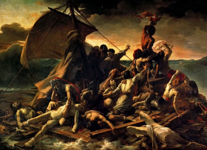
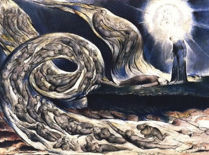
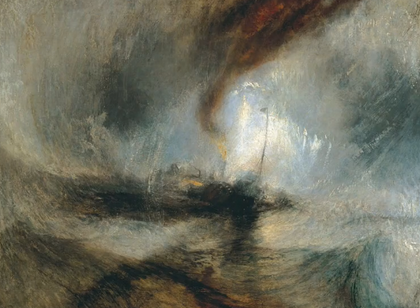
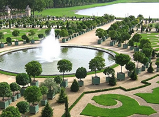

<h1 align="center"><b> 20 Romanticism Summary Notes </b></h1>

> Related: [HOI Notes](/tcfs-notes/HOI/README.md) | [19 Responses to the Industrial Revolution Summary Notes](hoi-19-summary-notes.md) | [21 Imperialism and Darwinism](hoi-21-summary-notes.md)

<h1>Table of Contents</h1>

- [Romanticism](#romanticism)
- ['Sentimental Enlightenment'](#sentimental-enlightenment)
- [Romanticism in Context](#romanticism-in-context)
- [Romantic Art](#romantic-art)
- [Poetry](#poetry)
- [Romanticism, Nature and Science](#romanticism-nature-and-science)
- [Romanticism and Politics](#romanticism-and-politics)
- [[Tutorial] Romanticism](#tutorial-romanticism)

# Romanticism
* Late 18th-19th century movement 
* Most prominent in Literature and Art 
  * but also found in philosophy and science 
* Romanticism VS Enlightenment 
  | Romanticism                                                                                                                                     | Enlightenment                                                                                                                                                                                                                                                                                                  |
  | :---------------------------------------------------------------------------------------------------------------------------------------------- | :------------------------------------------------------------------------------------------------------------------------------------------------------------------------------------------------------------------------------------------------------------------------------------------------------------- |
  | • imagination  • feeling/emotion  • creativity  • uniqueness  • subjective experiences  • freedom  • wild nature  • holism | • belief in progress through reason  • New ideas  • Challenged authority (Chirch)  • Inspired by the 'new science'    • search for universal natural laws of human society  • Find truth based on observation and reasoning  • Mechanistic view of nature  • Secular (not anti-religious) |

# 'Sentimental Enlightenment'
* involved a reappraisal of emotion and feeling 
* rejected 'rationalist' enlightenment and reason in separation from the emotions and body 
* Interest in innate virtues 
  * benevolence 
  * good will 
  * sympathy 
* connected to idea of 'sensibility' 
* Examples: Hume and Rousseau and Adam Smith

# Romanticism in Context
* Industrial revolution 
* Sentimental Enlightenment 
* Climate change and pollution 
* Luddites 
  * organization of English textile workers 
  * Protesting replacement of human skilled labour by machine and eroding of labour practices 
  * Supported by Lord Byron 

# Romantic Art
* Art as a creative, expressive act - not trying to replicate external reality or follow rules 
* Valued subjectivity, 'heroic' individuals and artists 
* Over-emphasis on reason oppresses inspiration, spontaneity, creativity 
* Examples of Romantic Art 
  * The Raft of the Medusa by Théodore Géricault 
    * chaotic scene - eye does not rest at one person 
    * aftermath of a shipwreck 
    * more emotion 
  * The Lovers Whirlwind by William Blake 
    * completely original style 
  * Snow Storm: Steam-Boat off a Harbour's Mouth by J.M.W. Turner 
    * subjective artwork 
    * capsized ship in the storm 
* harks back to ancient Greece/Rome 
* Emphasises order, simplicity, symmetry 
* Tames nature through 'civilisation' 
* rules of good art 
  * "What has pleased, and continues to please, is likely to please again: hence are derived the rules of art, and on this immovable foundation they must ever stand" Jushua Reynolds 
    * example of inductive reasoning 
* Examples of Neo-calssicism 
  * Jardins du Château de Versailles  
    * garden 
    * taming nature 
    * mathematical 
    * order, symmetry 
  * Oath of the Horatii by Jacques-Louis David  
    * painting 
    * look Roman 
    * background - greco-roman architechture 
      * realistic - anatomy, renaissance 
    * staged - unnatural 
    * symmetry 
    * 3 arches - composition of symmetry 
* "To generalise is to be an idiot" (William Blake) 
  * general rules to all art do not exist 

# Poetry
* poetry was everywhere 
* gets rid of the law ans understanding of reason 
* 'First generation' romantic poets 
* 'Second generation' romantic poets 
  * Lord Byron 
  * Percy Shelly 
  * John Keats 
    * all died young 
    * lived daring lives 
* use imagination to create something 

# Romanticism, Nature and Science
* Value nature 
* especially the experience of reflecting on vast, awe-inspiring, wild extremes 

# Romanticism and Politics
* nationalism 

# [Tutorial] Romanticism
1. What, when and where was Romanticism?
   *  Romanticism was a highly influential **cultural movement** during the **late 18th and early
19th century** in **Europe**- It valued imagination, feeling/emotion, creativity, uniqueness etc.
1. What are some of the key features of romanticism?
   *  imagination
   *  feeling/emotion
   *  creativity
   *  uniqueness
   *  subjective experiences
   *  freedom
   *  wild nature
   *  holism
3. Which of the following are Romantic or Enlightenment?
   *  \[Romanticism\] Imagination and feeling are just as important to understanding as reason
   *  \[Enlightenment\] There are universal, natural laws (such as universal human rights) that apply
to everyone, regardless of their culture
   *  \[Romanticism\] Religion and religious feelings are important aspects of humanity
   *  \[Romanticism\] Humans and nature are irreducibly complex, and subject to hidden forces
   *  \[Enlightenment\] To understand a phenomenon, we need to find the rational, mathematical
rules that govern it
   *  \[\] Prejudice and ignorance are the biggest problems in society, and they are best solved
through formal education
   *  \[Romanticism\] Tradition and experience are important sources of knowledge
   *  \[Romanticism\] Real freedom requires us to move beyond the intellect to find our authentic
self
   *  \[Romanticism\] I prefer long walks in nature to spending time in the city
   *  \[Romanticism?\] I think people are born naturally good and innocent
4. What is its relation to the Enlightenment?
   *  Romanticism was the reaction against Enlightenment
   *  They are almost total opposites

    | Romanticism| Enlightenment|
    |:--|:--|
    |Imagination and creativity |Rationality and logic|
    |Religion Secular, Challenged Authority| Tradition New Ideas, New Science|
5. What is Romanticism's relation to the Scientific Revolution?
   *  Many romantics believed that science and poetry could complement each other
   *  Romantics interested in chemistry, electricity and magnetism, all of which suggested that, far
from being a lifeless universe, there was some internal force operating from within objects,
leading to the idea of vitalism.
   *  Rejection of mechanistic reductionism in favour of organic holism
6. What do you think is more important in human societies, reason or imagination? Why?
   *  They are both equally important
