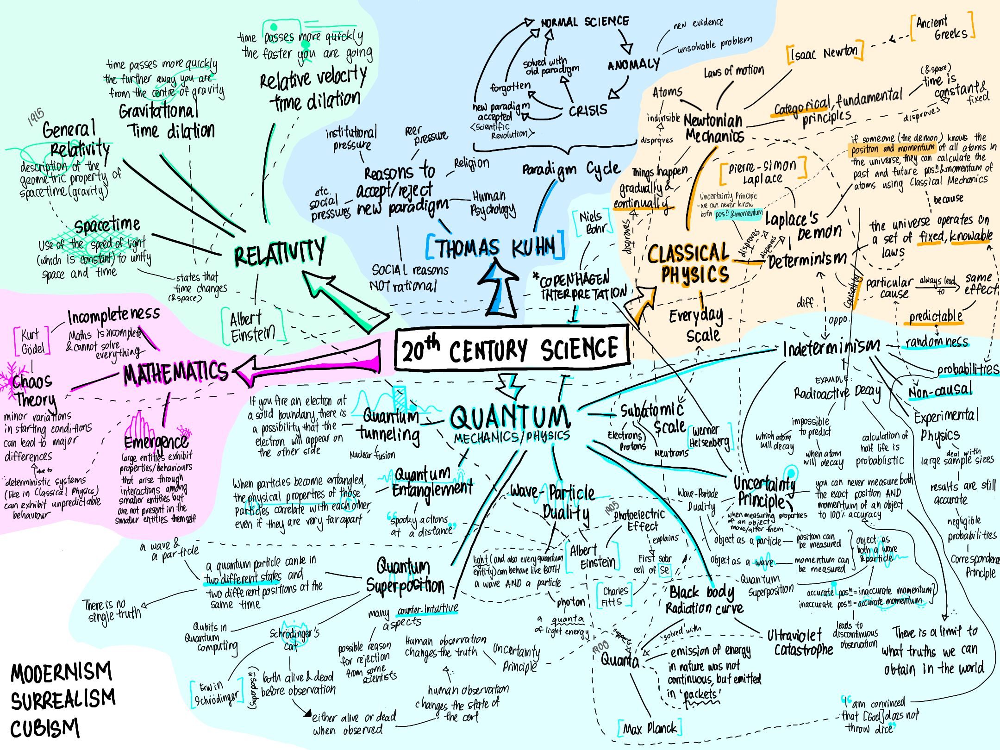

<h1 align="center"><b> Final Assessment Plan </b></h1>

> Related: [HOI Notes](/tcfs-notes/HOI/README.md)

<h1>Table of Contents</h1>

- [Final Assessment Information](#final-assessment-information)
- [Section A: Short Essay](#section-a-short-essay)
  - [Marking Scheme](#marking-scheme)
  - [How to Prepare for Section A (from tutorial)](#how-to-prepare-for-section-a-from-tutorial)
  - [Second-Wave Feminism](#second-wave-feminism)
    - [Reading List](#reading-list)
    - [Other Sources](#other-sources)
    - [Timeline](#timeline)
  - [Section A Practice](#section-a-practice)
    - [First-Wave Feminism Focal Points](#first-wave-feminism-focal-points)
    - [Second-Wave Feminism Focal Points](#second-wave-feminism-focal-points)
- [Section B: Primary Source Analysis](#section-b-primary-source-analysis)
  - [20th-Century Science](#20th-century-science)
    - [1. Quantum Mechanics: Indeterminism](#1-quantum-mechanics-indeterminism)
    - [2. Classical Physics: Determinism](#2-classical-physics-determinism)
    - [3. Quantum Mechanics: Wave-Particle Duality](#3-quantum-mechanics-wave-particle-duality)
    - [4. Relativity](#4-relativity)
    - [5. Quantum Mechanics: Uncertainty Principle](#5-quantum-mechanics-uncertainty-principle)
    - [6. Quantum Mechanics: Superposition](#6-quantum-mechanics-superposition)
    - [7. 20th-Century Mathematics / Quantum Theory >> Indeterminism: Chaos Theory](#7-20th-century-mathematics--quantum-theory--indeterminism-chaos-theory)
    - [8. Quantum Mechanics: Quanta](#8-quantum-mechanics-quanta)
    - [9. Classical Physics: Newtonian Mechanics](#9-classical-physics-newtonian-mechanics)
    - [10. Thomas Kuhn’s Paradigm Cycle](#10-thomas-kuhns-paradigm-cycle)
    - [Which ideas would you most expect to find in a source from that time period?](#which-ideas-would-you-most-expect-to-find-in-a-source-from-that-time-period)
  - [Section B Practice](#section-b-practice)
  - [Decolonisation](#decolonisation)

# Final Assessment Information
*  [Final Assessment Information Sheet (PDF)](sem2/../hoi-final-assessment-information-sheet.pdf)
* Tests breadth and depth of knowledge of the subject, as well as critical analytical skills developed throughout the intake.
* (Suggested) Reading Time: 20 minutes
* (Suggested) Writing Time: 4 hours
* Weighting: 35%
* Format: 
  * Word Document
    * Double Line Spacing
    * Times New Roman
  * Submit via Turnitin

# Section A: Short Essay
* The section A essay question will ask you to **select one idea** from the list below and to **discuss it in relation to the paired question**.
  * 1 Enligtenment Politics
    * This question will ask you to consider the relationship between Enlightenment political ideas (eg. the social contract) and earlier political concepts.
  * 2 Economic Liberalism
    * This question will ask you to consider the relationship between the ideas of Adam Smith and Thomas Malthus and the Industrial Revolution.
  * 3 Race (19 Century)
    * This question will ask you to consider Darwin’s ideas, as well as interpretations of his ideas, and their relationship to colonialism and nineteenth-century ideas about race.
  * **4 Second-Wave Feminism**
    * **This question will ask you to consider the focal points of second-wave feminism; it will require you to think about why second-wave feminism was particularly interested in these areas.**
  * 5 The Cold War
    * This question will ask you to consider the actual nature of the Cold War and how the Cold War did or did not affect different groups of people around the world.
* [Section A Reading List](hoi-final-assessment-reading-list.pdf)
* Word Limit: 750-1000 words
* 15%

## Marking Scheme
**13.5-15 (A)**
* Response to the Question
  * Responses are clearly focused, showing a high degree of awareness of the demands and implications of the question. Answers are well structured, balanced and effectively organized.
* Knowledge/Evidence
  * Knowledge is deatailed, accurate and relevant. Events and ideas are placed in their historical context, and there is a clear understanding of concepts. Examples used are appropriate and relevant, and are used effectively to support the evaluation.
* Argument/Evaluation
  * The response presents a well-developed evaluation. All, or nearly all, of the main points are substantiated, and the response argues to a reasoned conclusion.

## How to Prepare for Section A (from tutorial)
* Write a clear, **detailed definition** of any core ideas
* Gather **evidence** demonstrating the relationship of your idea to the relevant context or issue
  * Identify some examples, events etc. you can use as evidence
* Make up some **sample questions**
  * Practice writing **thesis statements** and **essay plans** for these questions

## Second-Wave Feminism
> This question will ask you to consider the focal points of second-wave feminism; it will require you to think about why second-wave feminism was particularly interested in these areas.

### Reading List
* Geoghegen, V. (2014). *Political ideologies: an introduction*. Hoboken: Taylor & Francis. 
  * Recommended pages: 197-203, 205-206
* Hannam, J. (2007). Feminism: a short history of a big idea. Harlow: Pearson-Longman.
  * Recommended pages: 142- 147, 151-156.
* Heywood, A. (2017). Political ideologies: an introduction (6th ed.). London: Palgrave.
  * Recommended pages: 221-229, 231-239.
  * [Heywood Notes](hoi-final-assessment-heywood-notes.pdf)
* LeGates, M. (2001). In their time: a history of feminism in western society. New York: Routledge.
  * Recommended pages: 327-364 (esp. 346 onward).
* Tong, R. (2013). Feminist thought: a comprehensive introduction. Hoboken: Taylor & Francis.
  * Recommended pages: 1-9
* Walters, M. (2005). Feminism: a very short introduction. Oxford: Oxford University Press.
  * Recommended pages: 77-88.

### Other Sources
* [Origins of Second-Wave Feminism with Linda Gordon | YouTube (6:39)](https://www.youtube.com/watch?v=d1lcyt-oA5o&list=PLTM6gea8x70igaPwm50lX5EmPASsGAZO7&index=2&t=60s)
* [Second-wave feminism | Wikipoodia ](https://en.wikipedia.org/wiki/Second-wave_feminism)
* [The most notorious act of protest for women's suffrage | Vox | YouTube (8:15)](https://www.youtube.com/watch?v=0EIFDSb7tWc&list=PLTM6gea8x70igaPwm50lX5EmPASsGAZO7&index=6)
* [Women's liberation movement | Wikipoodia](https://en.wikipedia.org/wiki/Women%27s_liberation_movement)
* [Women's Suffrage: Crash Course US History | YouTube (13:31)](https://www.youtube.com/watch?v=HGEMscZE5dY&list=PLTM6gea8x70igaPwm50lX5EmPASsGAZO7&index=3)

### Timeline
* compiled after reading the recommended readings

<table>
    <tr>
    <th>Year</td>
        <th>Key Figures/Books</th>
        <th>Details</th>
    </tr>
    <tr>
        <td>1405 and earlier</td>
        <td>[Christine de Pisan]<br><i>Book of the City of Ladies</i></td>
        <td><ul><li>Italy, Greece, China<li>Foreshadowed many of the ideas of modern feminism<li> Advocate:<ul><li>Women’s right to education <li>Women’s right to political influence</ul></ul></td>
    </tr>
    <tr>
        <td>19th Century</td>
        <td rowspan="2">[Mary Wollstonecraft] <br><i>A Vindication of the Rights of Woman</i><br><br>[John Stuart Mill] <br><i> The Subjection of Women</i></td>
        <td><ul><li>First organised Women’s Movements<li>First modern text of Feminism </ul></td>
    </tr>
    <tr>
        <td>Mid-19th Century</td>
        <td><ul>
        <li> <b>FIRST-WAVE FEMINISM</b>
        <li> Goal: Same legal and political rights as men
        <ul>
        <li> Women’s suffrage (right to vote)
        <li> Married women to be allowed to own and inherit property
        <li> Married women obtain legal identity independent from husbands’
        </ul>
        <li> Belief: if women could vote, all other forms of sexual discrimination or prejudice would quickly dissappear
        <li> Liberal Feminism: a form of feminism that is grounded in equal rights for women and men in the public sphere
        </ul></td>
    </tr>
    <tr>
        <td>Early 20th Century</td>
        <td></td>
        <td><ul>
        <li> FIRST-WAVE Archivements
        <ul>
        <li> Women’s suffrage (right to vote)
        <li> Married women to be allowed to own and inherit property
        <li> Married women obtain legal identity independent from husbands’
        </ul>
        <li> Expectation vs Reality of Achievements
        <table>
        <tr>
            <th>Expectation</th>
            <th>Reality</th>
        </tr>
        <tr>
            <td>Full emancipation achieved</td>
            <td>Weakened and undermined the women’s movement</td>
        </tr>
        <tr>
            <td>Benefit to all women</td>
            <td>Benefit mostly to white, upper class women</td>
        </tr>
        </table>
        </ul></td>
    </tr>
    <tr>
        <td>1939-1945</td>
        <td colspan="2">WORLD WAR II</td>
    </tr>
    <tr>
        <td>1946</td>
        <td colspan="2">BABY BOOM</td>
    </tr>
    <tr>
        <td>1954-1968</td>
        <td colspan="2">CIVIL RIGHTS MOVEMENT</td>
    </tr>
    <tr>
        <td>..?</td>
        <td colspan="2">SEXUAL REVOLUTION..?</td>
    </tr>
    <tr>
        <td>1960s-1970s</td>
        <td>1963 - [Betty Friedan] <i>The Feminine Mystique</i><br><br>
        1970 - [Kate Millett] <i>Sexual Politics</i><br><br>
        1970 - [Germaine Greer] <i>The Female Eunuch</i><br><br>
        1949 - [Simone de Beauvoir] <i>The Second Sex</i>
        </td>
        <td><ul>
        <b>SECOND-WAVE FEMINISM</b>
            <li> Reaction against the renewed domesticity of women after WWII
            <li> Relaunch feminist thought
            <li> Acknowledged that legal & political rights ≠ true equality among men & women
            <li> [Betty Friedan] ‘The problem with no name’
            <li> ‘The personal is political’
            <ul>
            <li> More focus on the private sphere
            <li> [Kate Millett] [Germaine Greer] Focus attention on female oppression
                <ul>
                <li> Personal
                <li> Psychological
                <li> Sexual
                </ul>
            <li> [Kate Millett] Definition of politics
                <ul>
                <li> Power-structured relationships, arrangements whereby one group of persons is controlled by another
                </ul>
            <li> Gender Division
                <ul>
                <li> Traditional: ‘Public’ Man, ‘Private’ Woman
                <li> Gender: a social and cultural distinction between males and females
                <li> Sex: bioological and ineradicable differences between women and men
                </ul>
            <li> Goal: Women Liberation
                <ul>
                <li> Social Change: break Gender Stereotypes - Role of Women Domestically
                <li> Reproductive rights - contraceptives; freedom with marriage; access to abortion procedures
                <li> Economic Rights - equal pay; opportunity for promotion; hiring equality
                <li> Sexuality and representation of women’s bodies - unrealistic standards of beauty
                </ul>
            <li> Radical Feminism: A form of feminism that holds gender divisions to be the most politically significant of social cleavages, and believes that they are rooted in the structures of domestic life
            <li> Socialist/Marxist Feminism: A form of feminism that links the subordination of women to the dynamics of the capitalist economic system, emphasizing that women’s liberation required a process of radical social change
            </ul>
        </ul></td>
    </tr>
    <tr>
        <td>1990s ++</td>
        <td></td>
        <td><ul>
        <li><b>THIRD-WAVE FEMINISM</b>
        <li> Deradicalisation
        <li> Postfeminism
        <li> Radical diversificatio
            <ul>
            <li>[core] Liberal Feminism
            <li> [core] Socialist/Marxist Feminism
            <li>[core] Radical Feminism
            <li> Postmodern
            <li> Psychoanalytical
            <li> Black
            <li> Lesbian
            <li> Trans
            </ul>
        </ul></td>
    </tr>
</table>

## Section A Practice
1. What are the focal points of second wave feminism?
2. Why was second-wave feminism interested in these focal points? What caused them to focus on these issues? This is partially linked to the achievements and focal points of first-wave feminism.
* In groups, write a list of focal points of second wave feminism. Then try and write an answer to the question of why they focused on these issues.

### First-Wave Feminism Focal Points
* we should first look at the Focal Points of First-Wave Feminism to understand the historical context behind the Focal Points of Second-Wave Feminism
* Goal: Achieve the same legal and political rights as men
1. Women’s suffrage (right to vote)
   * Enlightenment thinking principles:
     * Liberty
     * Equality
   * If applied to men, should be applied to women as well
2. Property Rights: married women to be allowed to own and inherit property
3. Married women obtain legal identity independent from husbands’
4. Right to Education
   * [Mary Wollstonecraft] A Vindication of the Rights of Women
     * Argued that women were rational and education was necessary for them to perform their roles in society:
     * To educate their children
     * As ‘companions’ to their husbands
 * Liberal Feminism: a form of feminism that is grounded in equal rights for women and men in the public sphere
 * Belief: if women could vote, all other forms of sexual discrimination or prejudice would quickly dissappear
 * Outcome: 🎉Women could vote
   * BUT Expectation VS Reality (in [Timeline](#timeline))

### Second-Wave Feminism Focal Points
**1 Break Conformity to Gender-Specific Roles**
* Goal: Achieve genderless ‘personhood’
  * While the goal of First-Wave feminism was to achieve ‘Females are humans too’ status, they were still of ‘other persons’ status - Thus, Second-Wave built from this foundation to try to achieve genderless ‘personhood’, where men and women were not tied to any gender-specific roles and duties and were judged based on their skills and personalities instead of their gender.

**2 Rights Over One's Own Body**
* Reproductive Rights: Access to contraceptives; freedom with marriage; access to abortion procedures
* Sexuality and representation of women’s bodies - unrealistic standards of beauty
* Sexual violence (eg. marital rape)

**3 Economic Rights**
* Equal pay for equal work
* Equal opportunity for promotion
* Hiring equality

**Why was second-wave feminism interested in these focal points? What caused them to focus on these issues?**
* Because they had a taste of men’s privileges during WWII
  * WWII
    * Men → Drafted to War
    * Women → Worked and Filled Empty Jobs
      * Unions hired more female staff
      * Women filled vacant local leadership posts (*but higher ranks were almost always still filled by men)
      * Women attended national conferences
      * Women conferences were held
      * Encouraged women to publish educational materials
      * Gave women special training courses
  * Post-WWII
    * Everything went back to ‘normal’
    * In part because of Cold War paranoia
      * Created a climate inhospitable to ideas for social change (especially those with regard to family stability)
    * Politicians also promoted the domestic role of women
      * Baby Boom created pressure for domesticity
      * Giving family allowances to men whose wives stayed at home
      * Advertised an ‘ideal(nuclear) family’
        * Father: breadwinner
        * Mother: homemaker
        * And 2-4 children in a single-family suburban home
      * Women earn less than men
        * 1945, women were earning only 52% of what men earned
        * To discourage them from working and push them back into their domestic roles
  * This led to an increase in awareness of how male-dominated society was and how women were being oppressed
  * Revival of Feminine Ideas and Inspiration to demand social change
    * [Betty Friedan] The Feminine Mystique
    * Youth culture
    * Civil RIghts Movement
    * Gay rights
    * Sexual freedom - ‘free love’
* Growing awareness of the difference between Gender and Sex and how the private parts that we are born with does not define the boundaries of what we can/can not do
  * Gender VS Sex <not so clear cut differentiation until 1990s>

  |Gender|Sex|
  |:--:|:--:|
  |a **social** and **cultural** distinction between males and females (that is conditioned into society and confined people to certain roles in that society)|**biological** and ineradicable differences between women and men|
* And there was a growing awareness of issues faced by women in the private sphere in general
  * Which includes:
    * Sexuality
    * Relationships
    * Family Life
  * Issues which were not brought up in the First Wave because Second-Wave was driven by Radical and Socialist Feminists while First-Wave was driven by Liberal Feminists

<table>
<tr>
    <th>Radical Feminists</th>
    <th> Socialist Feminists </th>
    <th> Liberal Feminists</th>
</tr>
<tr>
    <td colspan="2">Private/Personal sphere is political too</td>
    <td>Only Public sphere is political</td>
</tr>
<tr>
    <td colspan="2">[Simone de Beauvoir] <i>The Second Sex</i>
    <ul><li>“One is not born, but rather becomes a woman”
    <li>Highlights that gender is a social construct rather than a biological trait - one is not conceived with a genetic makeup that is to serve a sole purpose of producing more children, being loyal and serving to a husband and doing domestic chores ;-; but they are conditioned as such</ul></td>
    <td>[Mary Wollstonecraft] <i>A Vindication of the Rights of Women</i>
    <ul><li>Argued that women were rational and education was necessary for them to perform their roles in society:
    <ul><li>To educate their children
    <li>As ‘companions’ to their husbands
    </ul></ul></td>
</tr>
<tr>
    <td>holds **gender divisions** to be the most politically significant of social cleavages, and believes that they are rooted in the structures of domestic life</td>
    <td>links the subordination of women to the dynamics of the **capitalist economic system**, emphasizing that women’s liberation required a process of radical social change</td>
    <td>grounded in **equal rights** for women and men in the **public sphere**</td>
</tr>
</table>

* Therefore, they focused on diminishing gender stereotypes by differentiating the difference between sex and gender because gender setreotypes/beliefs oppressed women in all areas and by changing the public perception of women - all other goals would be taken more seriously 
* Also linked to sex vs gender
  * Just because females are biologically capable of reproduction, the roles of a woman is not solely to give birth to a bunch of babies
  * Women were limited in work opportunities (domestic labor, bookkeeping, nursing, secretarial/clerical work, school teaching with lower wages), were still unable to obtain bank accounts/credit or rent a house without a man’s consent and sometimes could not go into public spaces without a male chaperone
    * Due to the cultural belief that women were not born ‘lesser than’ in comparison to men
  * Overthrow patriarchy within family
    * Female biology is not oppressive but the way in which men have controlled women as child bearers and child rearers is
    * Thus, access to reproduction-controlling/aiding technologies would liberate women


# Section B: Primary Source Analysis
* NOTE: Section B is really important and is worth more than Section A (so don't spend too much time writing a long-ass essay for Section A)


## 20th-Century Science
* [20th-Century Science PDF](hoi-final-assessment-20th-century-science.pdf)
* Rank the top ten most important/significant findings

* [Black and White Mindmap](hoi-final-assessment-image2.png)
### 1. Quantum Mechanics: Indeterminism
* Indeterminism is the idea that events are not caused deterministically due to the randomness and unpredictability of the universe; thus, ever event is probabilistic and non-causal
* This idea is one that directly questions and opposes the fundamental concept of [determinism](#2-classical-physics-determinism) that played an instrumental role in classical physics at that time; substituting the categorical, fundamental principles that governed the predictable effects of the universe with non-causal random outcomes of a probabilistic nature
* It is the most important idea because it overturned the dominant deterministic view of classical physics where the universe is a fine-tuned machine that works uniformly with fixed laws with a view where the universe works in a randomised manner, governed by truths that are unattainable and predictions of events are merely probabilistic.
### 2. Classical Physics: Determinism
* Determinism is an idea within classical physics which states that the universe operates on a set of fixed and knowable laws of causality, where a particular cause will always lead to the same effect; thus making the effect predictable
* This has lead to the concept of Laplace’s Demon by Pierre-Simon Laplace
  * According to determinism, if someone (the demon) knows the position and momentum of all atoms in the universe, they would be able to calculate the past and future positions and momentums of the atoms using Newtonian Mechanics due to the determinable, predictable nature of the atoms and thus know every event that happens in to every atom in the past, present and future.
  * There are various ideas within Quantum Mechanics that are directly against the existence of Laplace’s Demon; namely, the [Uncertainty Principle](#5-quantum-mechanics-uncertainty-principle) and [Chaos Theory](#7-20th-century-mathematics--quantum-theory--indeterminism-chaos-theory)
* Determinism is what drives the categorical, fundamental principles of Newtonian mechanics in classical physics and the belief that there is universal truth could be found.
* This idea was important in the 20th century because it was the existing paradigm of that time which was being challenged by the ideas of [indeterminism](#1-quantum-mechanics-indeterminism) within the new, developing paradigm of quantum mechanics in the 20th century.

|Classical Physics/Newtonian Mechanics|→|Quantum Physics/Mechanics|
|:--|:--:|:--|
|determinism|→|indeterminism|
|deterministic mathematics/the universe operates on a set of fixed and knowable laws; making everything calculable|→|probabilistic statistics|
|predictable|→|randomness|
|Causality: where a particular cause would always lead to the same effect|→|Non-causal outcomes|
### 3. Quantum Mechanics: Wave-Particle Duality
* Wave-Particle Duality, developed through the work of various physicists including Albert Einstein, is the concept that every quantum entity, including light, can behave like both a wave and a particle
* The idea of Wave-particle duality was first brought about by Albert Einstein when he described the phenomenon that was occuring in the first solar cell: the Photoelectric Effect.
* Within the explanation, Einstein proposed a new theory where light could behave like both a wave and a particle; with a particle of light being called a photon and also being described as a quanta of light energy. 
* Some interpretations of this concept state that every quantum entity can be both a wave and a particle at the same time. This relates to the idea of [superposition](#6-quantum-mechanics-superposition) in quantum mechanics.
### 4. Relativity
* The theory of relativity was developed by Albert Einstein
* Einstein’s idea of spacetime, where the speed of light (which is constant) is used to unify space and time on a curved geometric plane, states that time and space change.
* This idea of spacetime is one that directly challenges one of the fundamental principles in Newtonian mechanics, which states that time and space are fixed constants.
* The acceptance of both Quantum Mechanics and Einstein’s relativity could have been because both fields were in direct contradiction with the existing paradigm of Classical Physics
* If only one of the fields were of existence in the 20th century, scientists at that time could have still continued to side with Classical Physics’ deterministic views. However, with various ideas from both fields questioning the existing paradigm’s cornerstone (which is [Determinism](#2-classical-physics-determinism)) and providing scientists with heaps of evidence, if not to accept the new paradigms but at least question the existing one, the two fields in existence together were able to wear down the Classical Physicists of that time and become quintessential to modern technology,
### 5. Quantum Mechanics: Uncertainty Principle
* Developed by Werner Karl Heisenberg, the Uncertainty Principle is a principle that states that you can never measure both the exact position and momentum of an object.
* This is because of the [Wave-Particle Duality](#3-quantum-mechanics-wave-particle-duality), which states that quantum entities can behave like both a wave and a particle. When an object is taken as a particle, the position can be measured by the momentum cannot and when the object is taken as a wave, the momentum can be measured but the position cannot. Even if the object is believed to be in a superposition state of both a wave and a particle, accuracy in the object’s position cannot be achieved without compromising the accuracy in the object’s momentum and vice versa. Therefore, an accurate value of only either the object’s position or momentum can be obtained. 
* It also states that one cannot measure properties of an object without moving or altering them. For example, measurement of the positional property of an object is obtained via the reflection of light against that object; however, if the light wave is too strong, it may ‘push’ and alter the position of the object). Thus, an accurate value of the positional property of the object can never be known.
* there are just some truths that can never be known.
* According to Heisenberg’s Uncertainty Principle, [Laplace’s demon](#2-classical-physics-determinism) can never know the position and momentum of all atoms in the universe and thus can not know every event of the past, present and future. Essentially, the Uncertainty Principle proves that Lapalce’s Demon can never exist.
### 6. Quantum Mechanics: Superposition
* Quantum Superposition is the concept that a quantum particle can be in two different states and two different positions at the same time.
* Like many concepts of Quantum Mechanics, many aspects of it are counter-intuitive to our everyday, real-world experience. A famous thought experiment which captures its counter-intuitiveness is the thought experiment of Schrödinger’s cat, derived by Erwin Schrödinger, where a hypothetical cat is placed in a closed box with a radioactive substance that has a 50% chance of killing the cat. Schrödinger states that before the box is opened, the cat is both alive and dead, a superpositional state that is contrary to the binary of real-world experiences. However, when the box is opened, the can is revealed to be either alive or dead and not both because human observation changes the superpositional state of the cat. This idea that measuring or observing an object alters the object being measured is the [Uncertainty Principle](#5-quantum-mechanics-uncertainty-principle).
* The counter-intuitiveness of concepts like this is a possible reason for why some physicists reject certain theories in quantum mechanics or quantum mechanics altogether.
### 7. 20th-Century Mathematics / Quantum Theory >> Indeterminism: Chaos Theory
* A concept developed by Kurt Gödel, Chaos Theory states that minor variations in the starting conditions of a system can lead to major differences in the system’s outcome
* This idea demonstrated that what were initially thought to be [deterministic](#2-classical-physics-determinism) systems, such as those in Classical Physics, exhibit unpredictable and therefore [indeterministic](#1-quantum-mechanics-indeterminism) behaviour. 
* It also disproves the existence of [Laplace’s Demon](#2-classical-physics-determinism). 
### 8. Quantum Mechanics: Quanta
* A quanta is the smallest incremental ‘packet’ of energy that is emitted by objects in nature.
* The discovery of quanta by Max Planck in 1900 was what caused the field of Quantum Mechanics to emerge and eventually displace the deterministic views of classical physics at that time as it disproved a fundamental principle of Newtonian mechanics; the principle that things happened gradually and continually. 
* The discovery of quanta was further supported by Albert Einstein as he was describing the photoelectric effect with the idea of wave-particle duality; where light can behave like both a wave and a particle and that a particle of light, known as a photon, is actually a quanta of light energy.
### 9. Classical Physics: Newtonian Mechanics
* It relies heavily on the idea of [determinism](#2-classical-physics-determinism)
### 10. Thomas Kuhn’s Paradigm Cycle
* Thomas Kuhn’s Paradigm Cycle describe the process of paradigm shifts, which lead to scientific revolutions
* A paradigm is a set of common facts, basic commitments, assumptions and methods by which scientists do research.
* Normal Science (everyday puzzle solving using paradigm) → Anomaly (new evidence or unsolvable problem) → Crisis (question current paradigm with uncertainty) → [1] New paradigm accepted [2] New evidence or unsolvable problem forgotten [3] unsolvable problem or evidence solved with or explained by old paradigm

### Which ideas would you most expect to find in a source from that time period?
* Probably something about the tension between Quantum Mechanics/Relativity and Classical Physics in relation to Truth?
* Quantum Mechanics: Indeterminism VS Classical Mechanics: Determinism
* Quantum Mechanics: limitations to our ability to find truth//the truth does not exist//there is more than 1 truth VS Classical Mechanics: there is a truth and it can be sought

## Section B Practice
```
20th-Century Science [Practice Extract]
Albert Einstein, Extract from his letter to Max Born (1947) 

Dear Born  

If I were not a confirmed old rogue, with a fossilised bad conscience, I would not have been able to go for such a long time without writing to you… 

I cannot make a case for my attitude in physics which you would consider at all reasonable. I admit, of course, that there is a considerable amount of validity in the statistical approach which you were the first to recognise clearly as necessary given the framework of the existing formalism. I cannot seriously believe in it *[the quantum theory]* because the theory cannot be reconciled  with the idea that physics should represent a reality in time and space, free from spooky actions at a distance. I am, however, not yet firmly convinced that it can really be achieved with a continuous field theory, although I have discovered a possible way of doing this which so far seems quite reasonable. The calculation difficulties are so great that I will be dead long before I myself can be fully convinced of it. But I am quite convinced that someone will eventually come up with a theory whose objects, connected by laws, are not probabilities but considered facts, as used to be taken for granted until quite recently. I cannot, however, base this conviction on logical reasons…  

I am glad that your life and work are fruitful and satisfying. This helps one to bear the craziness of the people who determine the fate of homo sapiens (so-called) on the grand scale. Maybe it has never been any better, but one did not see it as clearly in all its wretchedness, nor were the consequences of the bungling quite as catastrophic as under  present conditions.  

Best wishes to you and your family. 

Yours  

A. Einstein
```

* You will be given four primary source extracts, one pertaining to each of the topics/time periods listed below. You will be asked to choose any two of the extracts. For each extract separately, you will be asked to: 
1. [2 marks] Briefly identify the overall argument or position of the extract
   * This extract is a letter from Albert Einstein, a german-born physicist known for developing his theory of relativity, to Max Born, a german physicist who was instrumental in the field of quantum mechanics. The letter contains Einstein’s arguments for rejecting Max Born’s ideas about quantum mechanics, specifically about quantum entanglement as it substitutes the existing paradigm of deterministic events and categorical, fundamental principles from classical physics that Einstein believed in with notions of  non-causal random outcomes of a probabilistic nature.
2. [3 marks] Explain at least three ideas that the extract contains, using brief quotations to show each idea; and
   * The most important idea in the extract is quantum mechanics, specifically quantum entanglement and the counter-intuitive, indeterminable nature of it that Einstein cannot accept.
   * Rejection to quantum mechanics - Quantum Mechanics: quantum entanglement and indeterminism
     * I cannot seriously believe in it [the quantum theory] because the theory cannot be reconciled  with the idea that physics should represent a reality in time and space, free from spooky actions at a distance and not yet firmly convinced
       * “It” refers to Quantum Theory/Mechanics
       * “Spooky actions at a distance” is referring to Quantum Entanglement
       * Explanation of what quantum entanglement/quantum theory is?
     * Belief that truth can be obtained - Classical Physics: determinism
       * [convinced in theory] connected by laws, are not probabilities but considered facts
       * Einstein adheres to the belief that there are deterministic laws and fundamental principles that define truth and also that it is possible to achieve complete truth from the natural world
     * Rejection of paradigm due to social, non-rational reasons
       * I cannot make a case for my attitude in physics which you would consider at all reasonable.
       * I cannot, however, base this conviction on logical reasons
       * Einstein’s belief Classical Physics’ old paradigm that the truth can be obtained with categorical, fundamental principles and deterministic laws of cause and effect hinders him from accepting the new paradigm of Quantum Mechanics despite its evidence
       * Quantum Entanglement implied that some sort of communication that was faster than light happens between particles that are distant from each other - something that Einstein’s theory of relativity rules out
       * there is a considerable amount of validity
       * Einstein is kind of in denial?
       * He admits to the rational evidence that supports 
3. [5 marks] Using the information in the extract and your broader knowledge, evaluate how important these ideas were in the time period in which the source was written
   * This was a possibly pivotal moment in the acceptance of quantum mechanics in science - the point in Kuhn’s model where people had 3 choices: Rejecting the new paradigm, forgetting about it or accepting the new paradigm
   * Einstein was a well known physicist at that time - if he rejected Quantum Mechanics with enough determination, many other people might have followed in his lead and rejected it too which would lead to yet another new paradigm being rejected due to irrational, social reasons that would then have to be revived decades later - which would technically slow down scientific progression

This extract is a letter from Albert Einstein, a german-born physicist known for developing the theory of relativity, to Max Born, a german physicist who was instrumental in the field of quantum mechanics. The letter contains Einstein’s arguments for rejecting Max Born’s ideas about quantum mechanics, specifically about quantum entanglement as it did not conform with his theory of relativity and substitutes the existing paradigm of determinism from classical physics that Einstein believed in with notions of indeterminism. `Absolutely spot on. This is the perfect way to do step (a).`

Einstein states that he is “not yet firmly convinced” and “cannot seriously believe in” quantum mechanics due its probabilistic nature and prefers a theory that is “connected by laws” and “considerable facts”. This probabilistic nature that he refers to is an idea in Quantum Mechanics called indeterminism. Indeterminism is the idea that events are not caused deterministically due to the randomness and unpredictability of the universe; thus, every event is probabilistic and non-causal. This idea is one that directly questions and opposes the fundamental concept of determinism that played a vital role in classical physics at that time; substituting the categorical, fundamental principles that governed the predictable effects of the universe with non-causal random outcomes of a probabilistic nature. Indeterminism is the most important idea in 20th-century science because it overturned the dominant deterministic view of classical physics where the universe is a fine-tuned machine that works uniformly with fixed laws with a view where the universe works in a randomised manner, governed by truths that are unattainable and predictions of events are merely probabilistic. `Fantastic.`

Einstein’s preference for a theory that is “connected by laws” and “considerable facts” demonstrates his adherence to the idea of determinism that is present in classical physics. Determinism is an idea within classical physics which states that the universe operates on a set of fixed and knowable laws of causality, where a particular cause will always lead to the same effect; thus making the effect predictable. Determinism was what drove the categorical, fundamental principles of Newtonian mechanics in classical physics and the belief that there is universal truth could be found. This idea was important in the 20th century because it was the existing paradigm of that time which was being challenged by the ideas of indeterminism within the new, developing paradigm of quantum mechanics in the 20th century. `Good, but maybe could have used a bit more detail.`

Additionally, Einstein also specifically rejects quantum entanglement “because the theory cannot be reconciled with the idea that physics should represent a reality in time and space”. Quantum entanglement is a concept which states that when particles become entangled, the physical properties of those particles correlate with each other, even if they are very far away and that knowing the state of one particle allows us to instantaneously know the state of the other. This concept suggests some sort of communication between the two particles that is faster than the speed of light; a suggestion that is Einstein’s theory of relativity rules out. `Excellent point.` With various concepts in quantum mechanics and Einstein’s theory of relativity being incompatible with each other, it is unsurprising that Einstein sides with his theory and describes concepts such as quantum entanglement as a “spooky action at a distance”. Although the idea of quantum entanglement is not particularly important in the 20th century, it was still part of the growing new paradigm of quantum mechanics and the immediate contradiction between it and the widely accepted theory of relativity could have caused a widespread rejection to the field of quantum mechanics as a whole. `Really great evaluation of importance.`

Lastly, Einstein’s argument against quantum mechanics being populated with more social reasons rather than rational, logical ones. This irrational thinking is also evident when Einstein states that there is a  “considerable amount of validity” of quantum mechanics and even admits that he “cannot...base [his] conviction on logical reasons” yet is still against quantum mechanics. Furthermore, his argument against quantum mechanics is also rather ironic as he himself had contributed to the concepts of quantum mechanics such as wave-particle duality and supported the discovery of quanta at that time. Einstein’s irrational rejection of this theory can be explained by Thomas Kuhn’s argument that scientists accept or reject theories based on social reasons rather than rational ones; where Einstein is rejecting quantum mechanics because it is does not conform with his theory of relativity and because he was “old” and was less likely to take up the new theory as he had dedicated most of his work on the basis of the existing theory. These social reasons for rejecting quantum mechanics were important in the 20th century because if Einstein rejected quantum mechanics with enough determination, despite the irrationality in his arguments, widespread rejection of quantum mechanics could still have emerged at that time. However, it could have also been because of the irrationality in his arguments along with the awareness of irrational arguments slowing the emergence of new paradigms historically that lead people to not side with Einstein’s social reasons and decided to allow the new paradigm to emerge instead. `Great.`

`827 words`

## Decolonisation
* I lost my notes :,